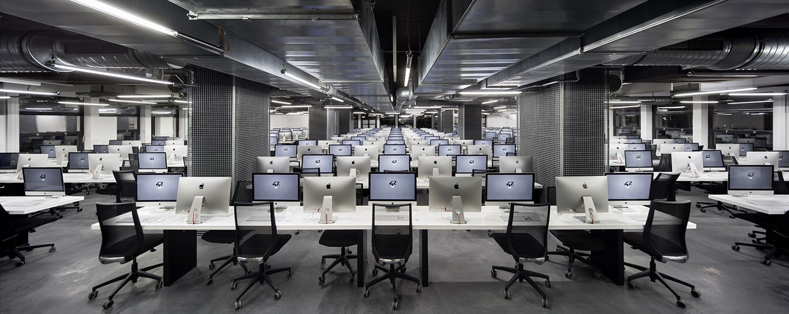

## Projects

  - [x] `libft` basic library
  
  - [x] `fillit` confrontation with tetris
  
  - [x] `get_next_line` essential parsing function
  
  - [x] `fdf` first graphical project
  
  - [ ] `printf` essential display function
  
  - [ ] `ls` list directory
  
  ***
  
<a href="https://github.com/tperraut"><b>By Thomas Perraut</b></a>

